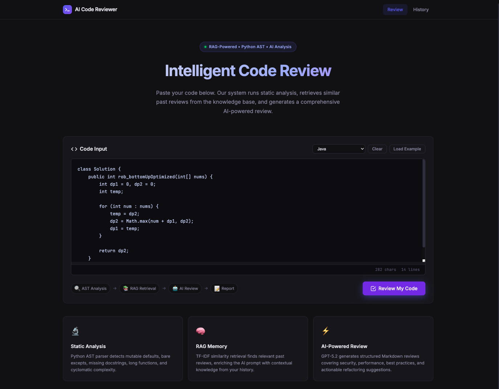
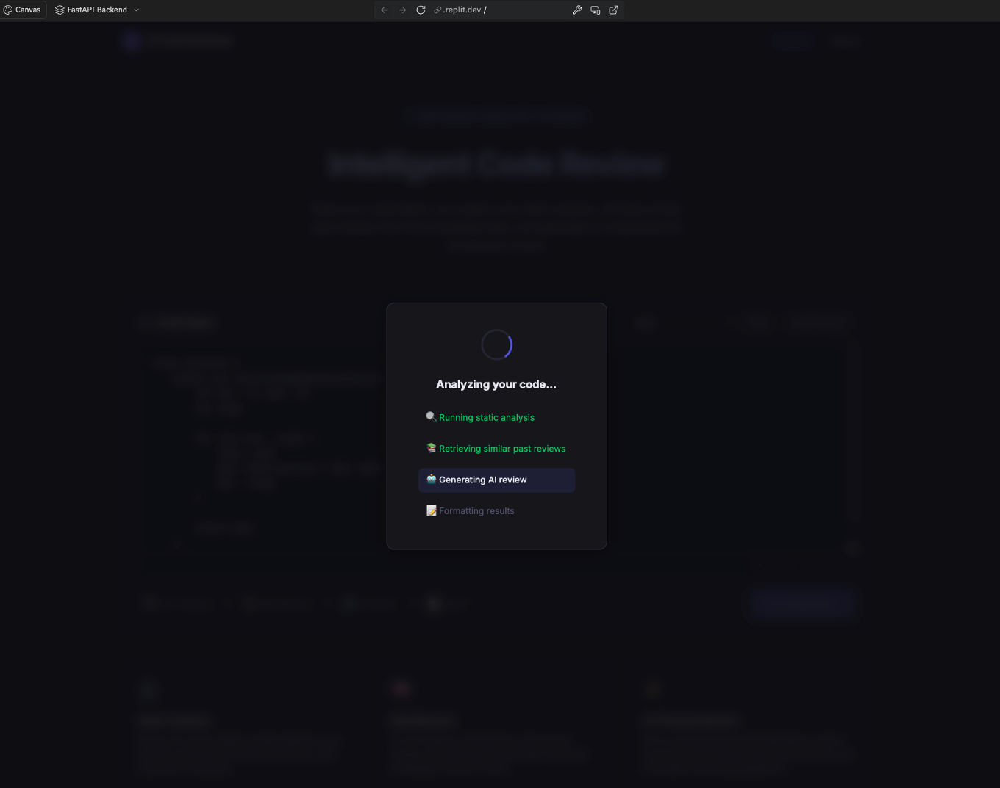
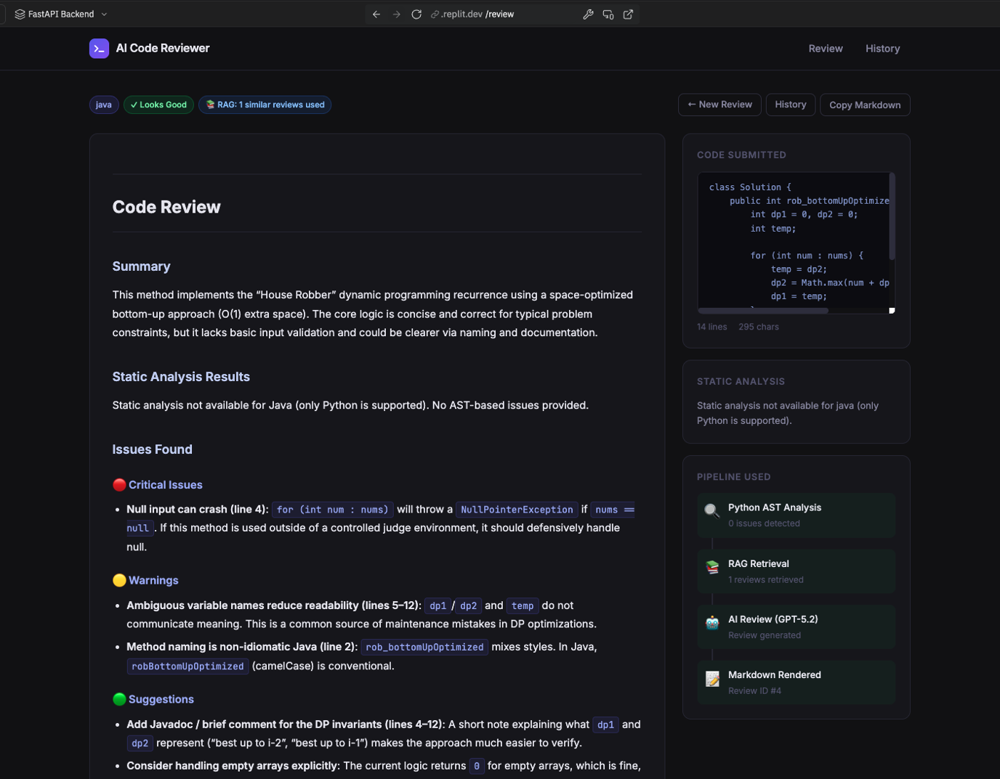
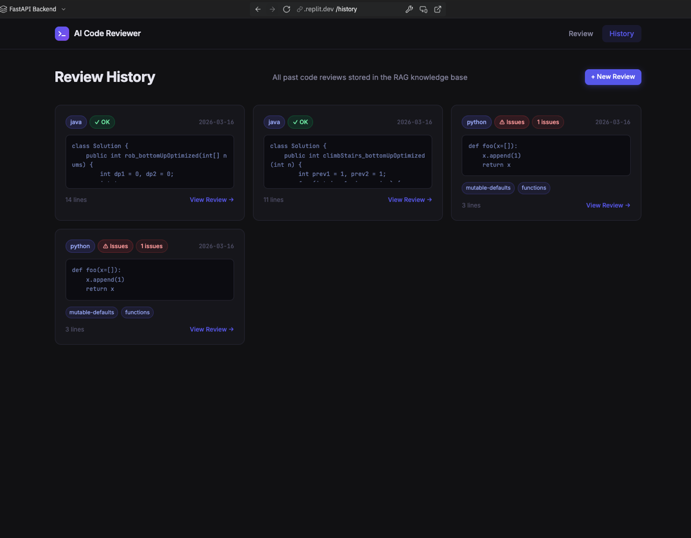

# 🤖 AI Code Reviewer

A RAG-powered AI code review application built with Python.

This project reviews submitted Python code by combining static analysis, RAG retrieval, and LLM-based review generation.
The main goal of this project was to understand how LLM applications can use previous data as context instead of simply sending a single prompt to the model.



---

## 🚀 Features

* Submit Python code through a web UI
* Analyze code using Python AST
* Detect common code quality issues
* Retrieve similar past reviews with TF-IDF and cosine similarity
* Generate structured Markdown code reviews using an LLM
* Store review history in SQLite
* Reuse past reviews as RAG context
* View previous review results from the history page

---

## 🧠 RAG + LLM Review Flow

```text id="m1cqul"
User Code Input
     ↓
Static Analysis Engine
     ↓
RAG Retrieval from Past Reviews
     ↓
Prompt Builder
     ↓
LLM Code Review
     ↓
Structured Markdown Feedback
     ↓
Save Review History
```

This application does not simply send code directly to an LLM.

Before generating a review, it retrieves similar previous reviews from the local database and adds them to the prompt as context.
This structure helped me understand the basic idea of RAG:

```text id="dxfzal"
Store previous data → Retrieve relevant context → Add it to the prompt → Generate a better response
```

---

## 🧱 Project Structure

```text id="a0jkw4"
ai-code-reviewer/
├── python-backend/
│   ├── main.py
│   ├── ast_analyzer.py
│   ├── rag_engine.py
│   ├── ai_reviewer.py
│   └── database.py
│
├── python-frontend/
│   ├── app.py
│   ├── templates/
│   │   ├── base.html
│   │   ├── index.html
│   │   ├── result.html
│   │   └── history.html
│   └── static/
│       ├── css/
│       │   └── style.css
│       └── js/
│           └── app.js
│
└── README.md
```

---

## 🛠 Tech Stack

### Frontend

* Python Flask
* HTML
* CSS
* JavaScript

### Backend

* Python FastAPI
* Uvicorn
* SQLite

### AI / RAG

* LLM-based code review
* TF-IDF vectorization
* Cosine similarity
* scikit-learn
* Python AST static analysis

---

## 🔍 Static Analysis

The backend analyzes submitted Python code using the built-in `ast` module.

Current analysis features include:

* Mutable default arguments
* Bare `except` clauses
* Global variable usage
* Long functions
* Missing docstrings
* Function count
* Class count
* Import count
* Cyclomatic complexity estimate

---

## 🧩 Main Components

### `ast_analyzer.py`

Analyzes Python code with AST parsing and extracts rule-based code quality signals.

### `rag_engine.py`

Retrieves similar past reviews using TF-IDF vectorization and cosine similarity.

### `ai_reviewer.py`

Builds the final LLM prompt using submitted code, static analysis results, and retrieved RAG context.

### `database.py`

Stores submitted code and generated review results in SQLite so they can be reused later as RAG memory.

---

## 📡 API Endpoints

| Method | Endpoint            | Description               |
| ------ | ------------------- | ------------------------- |
| POST   | `/api/review`       | Submit code for AI review |
| GET    | `/api/reviews`      | Get past review list      |
| GET    | `/api/reviews/{id}` | Get a specific review     |
| GET    | `/api/health`       | Health check              |

---

## 🖼 Screenshots

### Code Submission Page

```md id="vwi45r"

```

### AI Review Result Page

```md id="810a2v"

```

### Review History Page

```md id="47duh8"

```

---

## ⚙️ How It Works

1. User submits Python code from the Flask frontend.
2. FastAPI backend receives the code.
3. The AST analyzer extracts static analysis information.
4. The RAG engine searches for similar past reviews from SQLite.
5. Retrieved reviews are added to the LLM prompt as context.
6. The LLM generates a structured Markdown review.
7. The review result is saved to SQLite.
8. The frontend renders the result page.

---

## 💡 What I Learned

Through this project, I learned that an LLM application is not only about calling an AI model.

The important part is designing the flow around the model:

* What data should be stored
* What context should be retrieved
* How retrieved context should be added to the prompt
* How rule-based analysis and LLM feedback can work together

This project helped me understand the basic structure of a RAG-based developer tool.

---

## 📝 Note

This project was built with the help of Replit Agent.

The main purpose of this project was to explore how RAG and LLMs can be used in a practical code review application.
